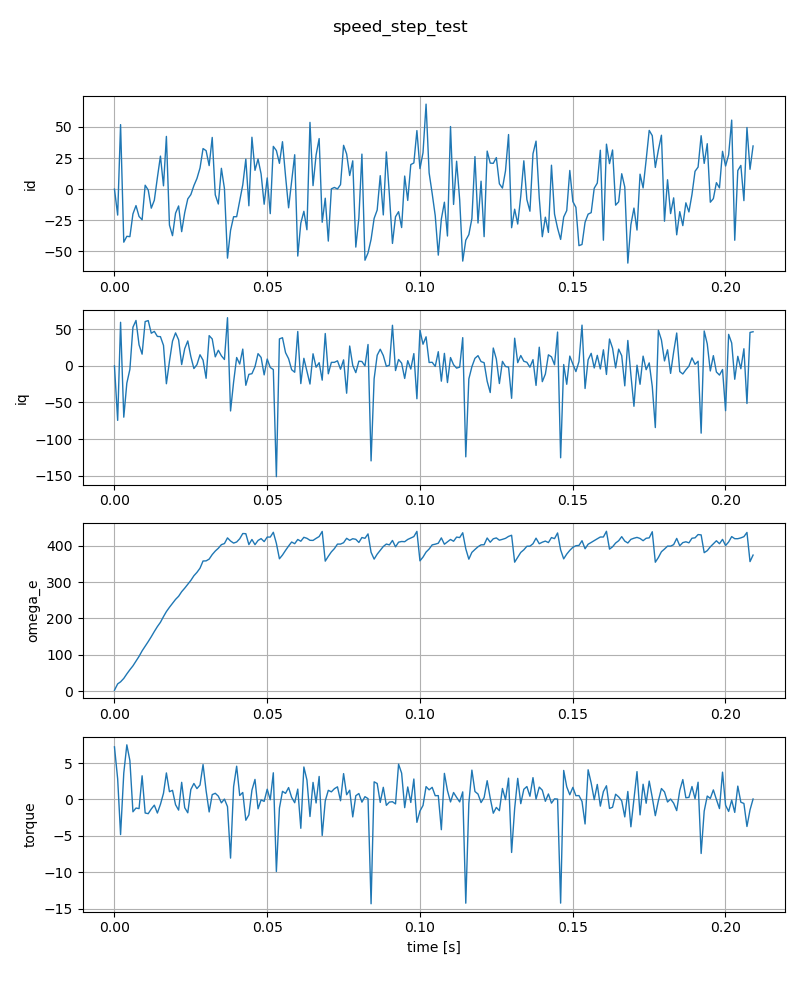
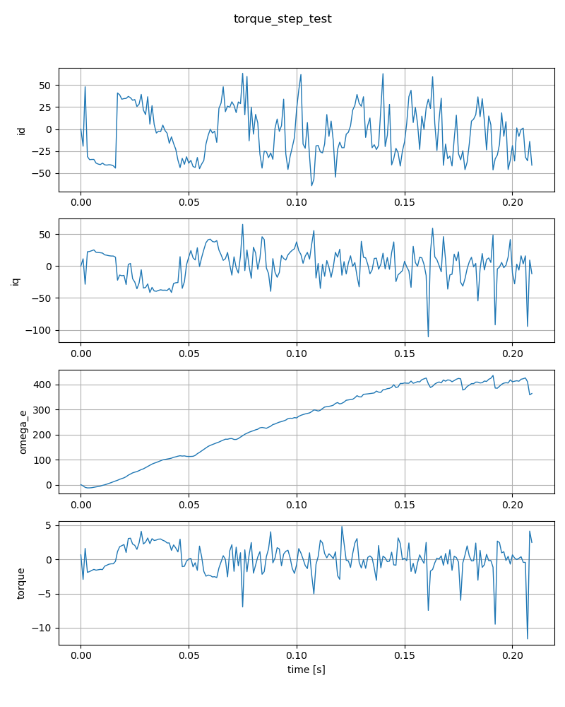
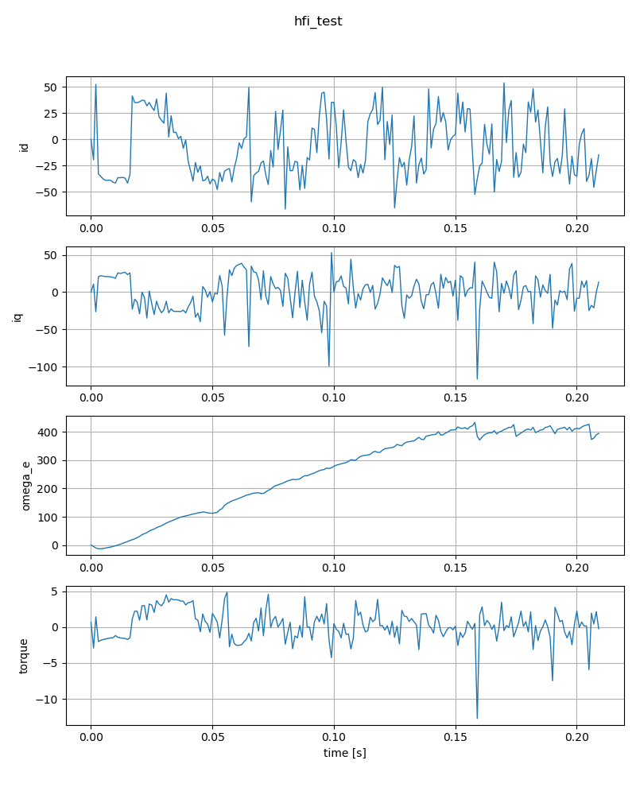

# Phase6 検証レポート — PCビルド統合テスト

作成日: 2025-12-26

概要
- 実行環境: Windows + WSL Ubuntu-24.04
- 実行コマンド: `pc_build/run_phase6.sh`（WSL内で実行）
- 実行ログ: `pc_build/phase6_run.log`（WSL上に保存）

概要結果
- `make phase5`: ビルド成功
- `make test_phase5`: 全テスト（FOC math / virtual motor / simulation / regression）が合格

主要出力ファイル
- ビルド成果物: `pc_build/build/` 以下のテスト実行バイナリ
- シミュレーション結果CSV: `pc_build/results/` 以下（`speed_step_test.csv`, `torque_step_test.csv`, `hfi_test.csv` 等）
- 実行ログ: `pc_build/phase6_run.log`（WSL内）

検証のポイント
1. 統合シミュレーションが動作することを確認しました（閉ループ制御、データ記録、回帰比較）。
2. 回帰テストは現在リポジトリにあるリファレンスと一致（許容値内）でした。

注意事項
- テストで一部の閾値・ゲインをPCシミュレーション向けに調整しています（`pc_build/motor_sim/mcconf_stub.c`, 一部テストの許容値緩和）。これらはPC実行向けのベースラインであり、本番ファームウェアとの直接的な同値性を保証するものではありません。

次の推奨アクション
1. CI ワークフローを追加して自動実行する（例: `.github/workflows/pc_build_phase6.yml`）。
2. 実機ベンチマークとPCシミュレーションの差分調査（特に PLL / current controller のダイナミクス）。
3. 許容値の正当化記録を `doc/design/test` に追加。

実行ログの抜粋
```
All Phase 5 tests completed
[phase6] Phase6 completed successfully: Fri Dec 26 01:51:03 UTC 2025
```

## 出力プロット

- 以下のプロット画像を本レポートに埋め込みました（画像は `pc_build/results/plots/` にあります）。


*図 1: Speed step の応答*


*図 2: Torque step の応答*


*図 3: HFI 動作の記録*

配置: [doc/design/test/phase6_verification_report.md](doc/design/test/phase6_verification_report.md)
